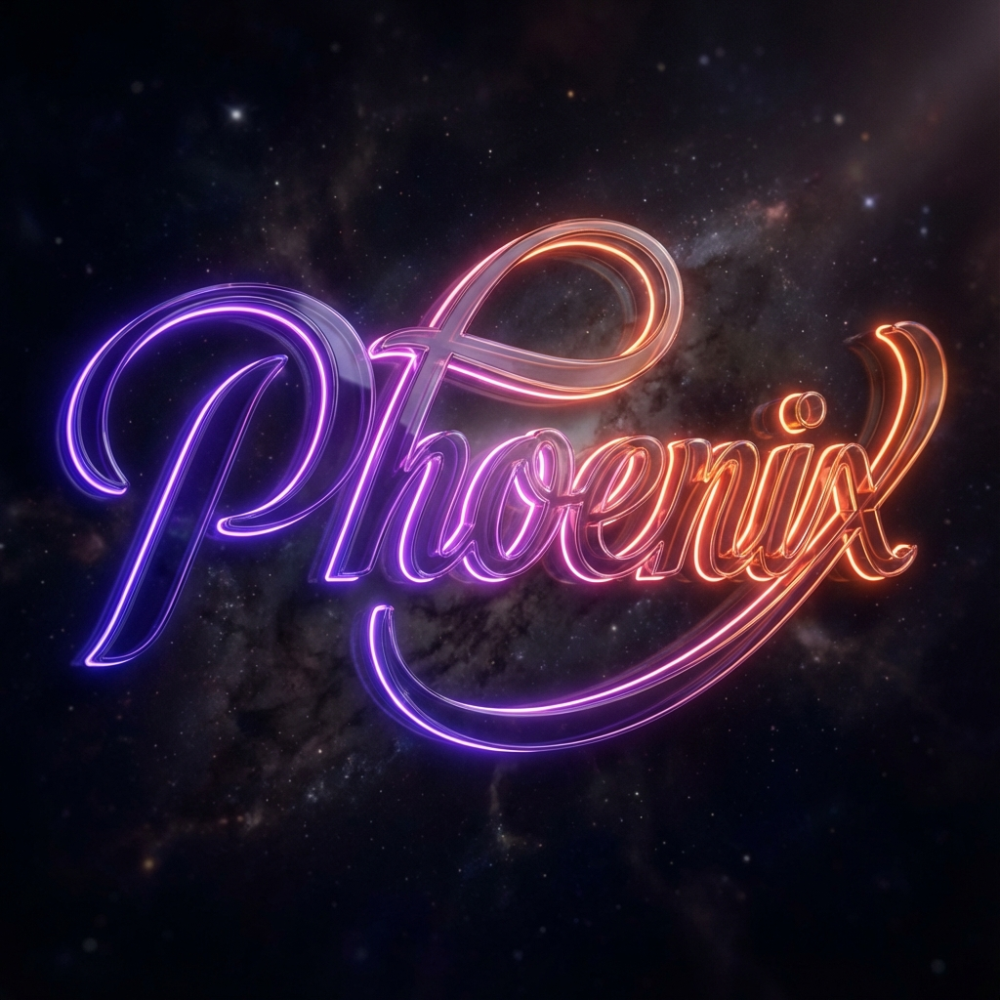
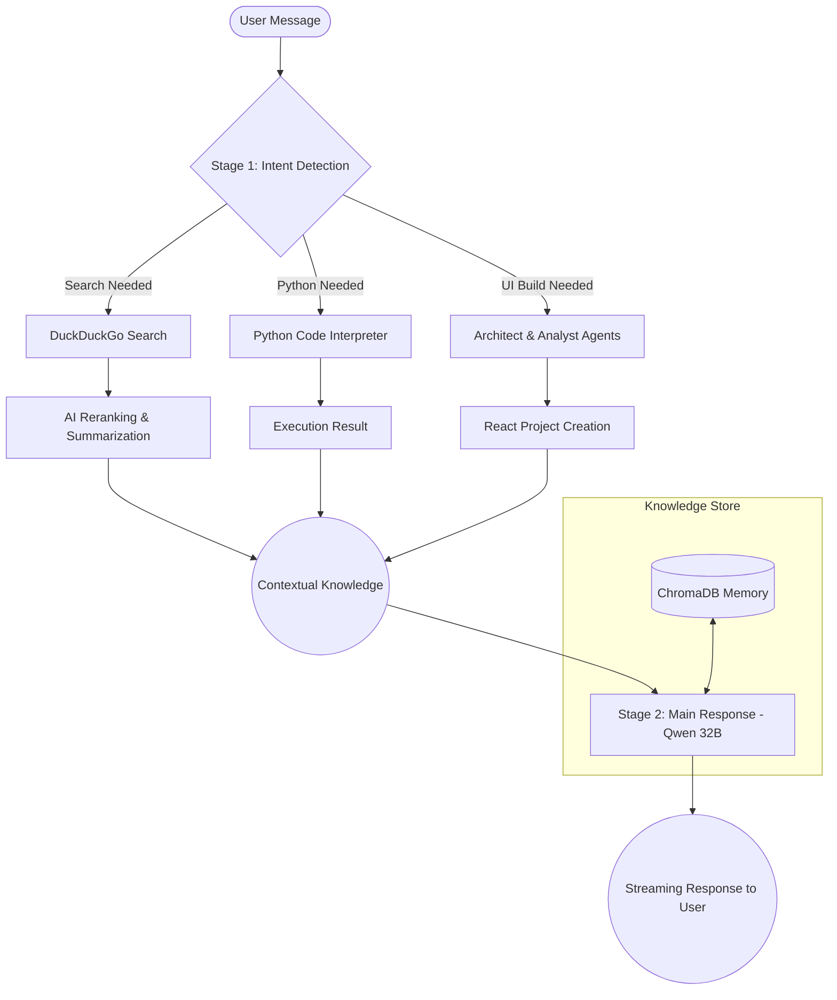

# PHOENIX AI CHAT
**The Ultimate Agentic Workspace for Next-Gen Creativity and Intelligence**

Phoenix AI is a sophisticated, multi-agent artificial intelligence platform designed for high-performance task execution, real-time information retrieval, and automated UI generation. Powered by a hybrid engine of the world's most advanced LLMs, Phoenix is more than just a chatbot—it is an intelligent OS for your ideas.

---

## Key Features

*   **Multi-Agent Orchestration**: Implements a 2-stage reasoning pipeline for precise intent detection and high-quality responses.
*   **Advanced Web Intelligence**: Real-time web search via DuckDuckGo with AI reranking and deep summarization.
*   **Autonomous UI Builder**: Generates full-stack React components and multi-file projects from a single prompt.
*   **Integrated Code Interpreter**: Safely executes Python code to solve math, data analysis, and logic problems.
*   **Global Recursive Memory**: Uses ChromaDB vector storage for persistent, cross-session long-term memory.
*   **MCP Integration**: Connected to the Model Context Protocol (MCP) for direct filesystem and tool interaction.

---

## Operational Flow

Phoenix uses a proprietary "Double-Strike" logic to ensure every interaction is grounded and accurate.



---

## AI Model Pipeline

Phoenix utilizes a specialized Multi-Agent architecture where each task is handled by the most suitable model:

| Component | Model ID | Purpose |
| :--- | :--- | :--- |
| **Orchestrator** | `meta-llama/llama-4-scout` | Intent detection & tool routing (Stage 1) |
| **Core Intelligence** | `qwen/qwen3-32b` | Main reasoning & conversational response (Stage 2) |
| **UI Architect** | `google/gemini-3-flash` | High-speed React component generation |
| **Code Expert** | `moonshotai/kimi-k2` | Documentation & complex code explanations |
| **Search Queries** | `openai/gpt-oss-120b` | Keyword optimization & query generation |
| **Knowledge Reranker**| `groq/compound-mini` | Search result scoring & filtering |
| **Memory** | `text-embedding-004` | Vector embeddings for RAG (ChromaDB) |

---

## Technology Stack

| Component | Technology |
| :--- | :--- |
| **Frontend** | React 18, Vite, TypeScript, Tailwind CSS, Framer Motion |
| **Backend** | Python 3.10+, FastAPI, Uvicorn |
| **Infrastructure** | Model Context Protocol (MCP), Docker Support |
| **Database** | ChromaDB (Vector), Firebase (NoSQL - Optional) |

---

## 📂 Project Structure

```bash
Agent/
├── phoenix-ai-chat-ui/    # Frontend React Application
│   ├── src/               # Component Logic
│   └── components/        # Premium UI Elements
├── src/                   # Backend Python Engine
│   ├── api_server.py      # FastAPI Main Entry
│   ├── ai_core.py         # Multi-Model Adapter
│   ├── search_engine.py   # Agentic Search Pipeline
│   ├── ui_builder.py      # Automated UI Factory
│   └── config.py          # Central Model Configuration
├── prompts/               # Engineering System Prompts
└── workspace/             # AI-Generated Builds & File Storage
```

---

## ⚙️ Installation & Setup

### 1. Requirements
*   Python 3.10+
*   Node.js 18+
*   API Keys: Groq, Google Generative AI (Gemini)

### 2. Backend Setup
```bash
git clone <your-repo>
cd Agent
pip install -r requirements.txt
# Create .env with GROQ_API_KEY and GOOGLE_API_KEY
python src/api_server.py
```

### 3. Frontend Setup
```bash
cd phoenix-ai-chat-ui
npm install
npm run dev
```

---

## 🎨 Branding & Aesthetic
Phoenix AI follows a **"Deep Tech / Amber Obsidian"** design language, emphasizing glassmorphism, subtle micro-animations, and high-contrast accessibility.

> "To rise from the ashes is to evolve. Phoenix AI doesn't just answer; it builds."

---
*© 2025 Phoenix Intelligent Systems. Built with passion for the future.*
